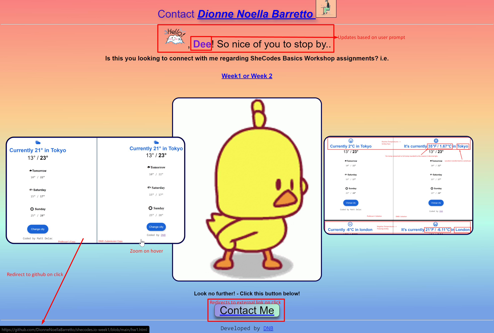

# Project Ask

Create a landing page from scratch about something you’re passionate about. The page should include a user interaction.

## DNB [Solution](https://dionnenoellabarretto.github.io/shecodes.io-Week3_Project/)




### HTML requirements

✅ Include these the following HTML elements tags

```text
h1, h2, p, div, span, strong, em, br, hr, a, img, button
```

### CSS requirements

✅ Use the following CSS properties

```text
margin, padding, font-size, font-weight, color, background (with linear-gradient), line-height, box-shadow, border, transition
```

### JavaScript requirements

✅ Use the following JS functionalities

```text
let, if, else, alert, prompt, event
```

#### 🥛 Example

Check out [this](https://www.shecodes.io/demos/project) or [this](https://www.shecodes.io/students/projects?product=workshop) page, for inspiration only 🙈

#### 🖼 Image uploader

If you need to use images from your computer, you can use [this](https://www.shecodes.io/uploads) image uploader to include your images on your project.
